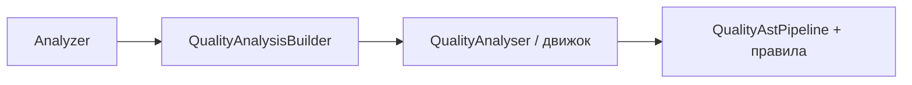

# Laravel-style DX в Soda

Один очевидный вход для качества кода, знакомые команды в духе Artisan и ровно столько абстракций, сколько нужно — не больше.

## Зачем это

Если вы уже пишете на Laravel, вам не должно требоваться читать половину `src/`, чтобы прогнать правила или добавить своё. Здесь зафиксированы **целевая модель DX** и **границы ответственности**, чтобы API и CLI оставались предсказуемыми.

**Имена в документах и ТЗ:** где встречается бинарь `analyzer`, в этом репозитории имеется в виду **`soda`**. Соответствия: `soda quality` — прогон правил; генерация и справка — `soda make:rule`, `soda list:rules` и т.д.

## В двух строках

| Что | Как |
|-----|-----|
| Качество (метрики + правила) | `Analyzer` — фасад и билдер |
| Только LOC/структура проекта | `ProjectMetrics` (`src/ProjectMetrics.php`) — не путать с `Analyzer` (качество) |

## Аудит DX (что мешало и что исправили)

| Зона | Было | Почему больно |
|------|------|----------------|
| Вход | `new QualityAnalyser()->analyse($files, …)` | Не читается «с улицы» |
| Правила | Много файлов на одно правило | Высокий порог входа |
| CLI | В основном `quality` / `analyse` | Не хватало `make:*` как у Artisan |

**Оставляем как есть:** `RuleCatalog`, `PhpFileQualityExtractor`, `QualityAstPipeline`, контракт правил (`RuleChecker`), `QualityAnalysisContract`.

## Карта каталогов (без лишних слоёв)

```
src/
  Analyzer.php                 # вход «качество»
  QualityAnalysisBuilder.php
  Quality/
  Commands/                    # Quality, MakeRule, ListRules, …
stubs/
  rule.stub
```

Опционально **в приложении пользователя** (рядом с его `soda.json`, не в `vendor/`): `config/soda.php` — список дополнительных классов `RuleChecker`, если не хочется трогать `RuleRegistry` в форке пакета.

Отдельный абстрактный `Support\Pipeline` не вводим, пока реальный код его не просит — иначе шум. Цепочка visitor’ов уже собрана в `QualityAstPipeline`.

## Публичный API

```php
Analyzer::file($path)->run();

Analyzer::paths([$dir])
    ->config($pathToSodaJson)
    ->debug()
    ->run();

Analyzer::analyze($paths, debug: false, configPath: null);
```

Доменный движок (`QualityAnalyser` и связанные классы) тот же; меняется **способ вызова** — короткий и явный.

## «Pipeline»

Под капотом порядок обхода AST задаёт **`QualityAstPipeline`**. Если позже понадобится общий middleware для других подсистем — можно подключить `illuminate/pipeline` или тонкую обёртку. До реальной потребности классы не плодим.

## Правила и CLI

- Контракт проверки: **`RuleChecker`**.
- **`soda make:rule`**, **`soda list:rules`** — тот же DX-паттерн, что у генераторов Laravel.
- Кастомные `RuleChecker` без форка: в **корне своего проекта** завести `config/soda.php` с ключом `rules` (ищется рядом с найденным `soda.json` или вверх от сканируемых путей). В `vendor/bunnivo/soda` этого файла нет и не нужно.

Подробнее: [ADDING_A_QUALITY_RULE.md](ADDING_A_QUALITY_RULE.md), [NAMING_RULES.md](NAMING_RULES.md).

## Было → стало

**Было:**

```php
$analyser = new \Bunnivo\Soda\Quality\QualityAnalyser();
$result = $analyser->analyse($files, false, null);
```

**Стало:**

```php
use Bunnivo\Soda\Analyzer;

$result = Analyzer::paths($files)->run();
```

## Поток (упрощённо)



---

Принцип: **простой фасад снаружи, знакомые команды в CLI, без преждевременных абстракций внутри.**
